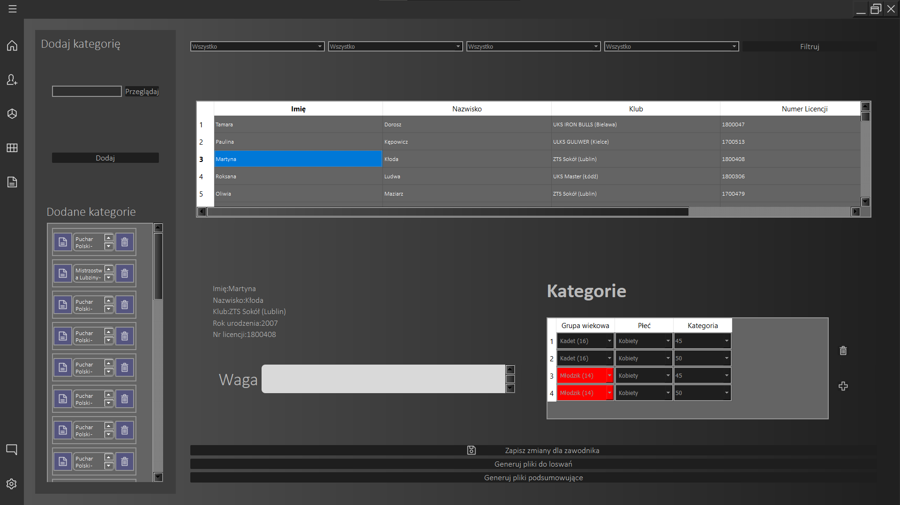
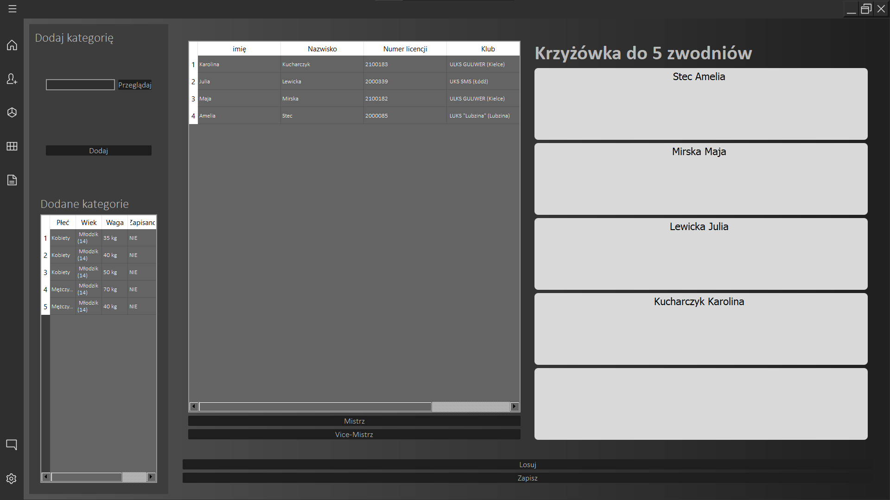
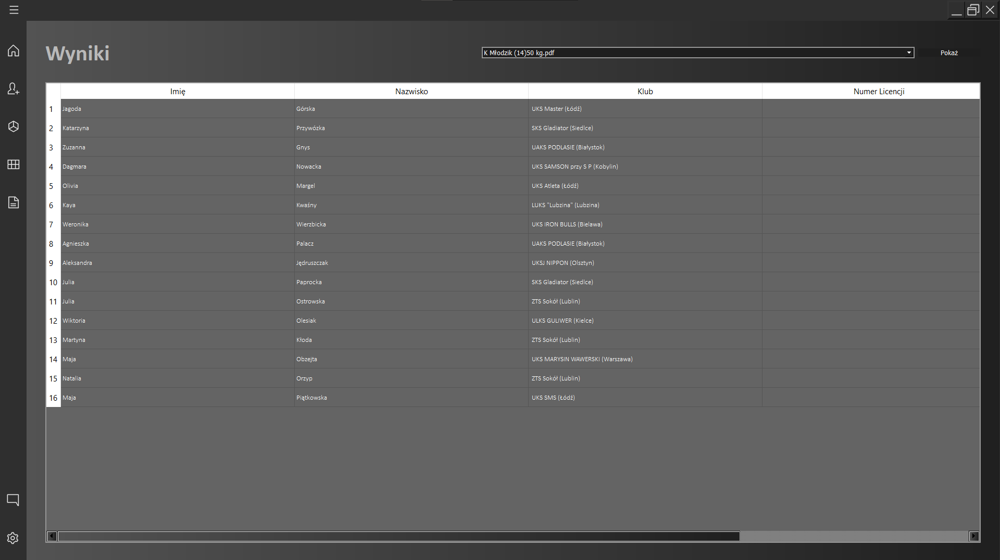

#Sumo Match Maker

### This program will be using by Polish Sumo Federation to coordinate sumo tournaments around the country.

###  Main functionality of program is
- Importing competitors from pdf's downloaded from sportzona.pl

- Draw competitors according Polish Sumo Federation's criteria

- Making matches between competitors according Polish Sumo Federation's criteria

- Generating reports from all categories

###  Future functionality of program will be:
- Generating reports from tournament
- Connect program with MySQL DB
- Connect program with sportzona.pl web page using Selenium

### Used technologies
- Python 3.7.1
- Qt5 by pyQt5 and PySide2
- pdf plumber and reportlab

